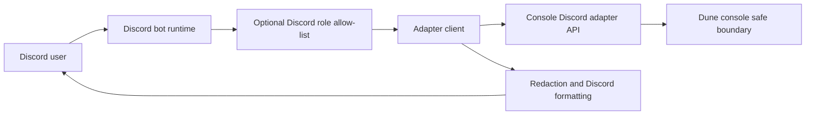

# Design and Architecture

## Executive Summary

This project moves Discord bot functionality into a separate repository and
keeps the Dune console as the safety boundary. The bot is read-only in v1. It
uses Discord slash commands to request health, status, readiness, and service
state from the console's Discord adapter API.

The bot does not require upstream console code changes, Docker socket access,
database credentials, raw shell commands, or mounted game files. Upstream only
needs to ship the disabled-by-default, bearer-token protected adapter API that
the maintainer already described.

## Technical Summary

Runtime flow:

1. A Discord user runs `/dune health`, `/dune status`, `/dune readiness`, or
   `/dune services`.
2. The bot checks the optional Discord role allow-list.
3. The bot sends a bearer-token authenticated request to the configured console
   adapter endpoint.
4. The console adapter returns JSON.
5. The bot redacts credential-shaped keys, bounds the Discord message length,
   and posts the response.



## Boundaries

- Discord bot repository owns command registration, Discord runtime,
  formatting, deployment docs, and tests.
- Console repository owns the read-only adapter API and any internal decisions
  about how health/status/readiness/services are gathered.
- The bot never calls Docker, never connects to the Dune database, and never
  executes console commands.

## Adapter Contract

Defaults are intentionally configurable:

| Function | Default method | Default path |
| --- | --- | --- |
| Health | `GET` | `/api/integrations/discord/health` |
| Status | `POST` | `/api/integrations/discord/status` |
| Readiness | `POST` | `/api/integrations/discord/readiness` |
| Services | `POST` | `/api/integrations/discord/services` |

Each request includes `Authorization: Bearer <token>`. `POST` requests include
minimal actor context:

```json
{
  "actor": {
    "userId": "discord-user-id",
    "guildId": "discord-guild-id",
    "channelId": "discord-channel-id",
    "roleIds": ["discord-role-id"]
  }
}
```

The bot accepts any JSON response. It does not rely on privileged fields or
console internals.

## Security Controls

- Read-only command surface.
- Bearer-token authentication to the console adapter.
- Optional Discord role allow-list.
- Credential-shaped keys are redacted before Discord output.
- Docker example runs with read-only filesystem, no new privileges, and dropped
  Linux capabilities.
- No Docker socket, DB credentials, raw command execution, or game-file mounts.

## Unit Testing

The package uses Node's built-in test runner:

```bash
npm test
```

Current coverage focuses on:

- Safe configuration defaults and validation.
- Adapter request method/path/auth behavior.
- HTTP error handling.
- Secret redaction and Discord message limits.
- Read-only slash command definitions and role checks.
