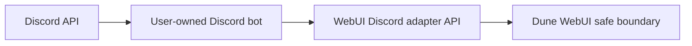

# Networking and Deployment Boundary

## Executive Summary

The safest deployment keeps the bot close to the WebUI adapter and keeps the
adapter off the public internet. Prefer Docker-internal networking or a private
LAN/VPN path.

## Recommended Topology



The bot talks outward to Discord and inward to the WebUI adapter. The WebUI
adapter should not need a public inbound route.

## Docker Network

When the WebUI and bot run as containers, attach them to the same Docker network
and set `DUNE_CONSOLE_API_URL` to the WebUI API service name:

```env
DUNE_CONSOLE_API_URL=http://console-api:3000
```

Do not mount the Docker socket into the bot container.

## WSL or Host Runtime

When the WebUI runs in WSL and the bot runs directly in WSL, prefer loopback or
the private WSL network address:

```env
DUNE_CONSOLE_API_URL=http://127.0.0.1:3000
```

Use the actual WebUI adapter port configured by the upstream stack.

## Public Exposure

Avoid exposing the Discord adapter endpoint publicly. If public exposure is
unavoidable, put it behind defense-in-depth controls:

- TLS
- firewall allow-list
- reverse proxy request size limits
- rate limiting
- adapter bearer token rotation
- logs that do not include token values

Public exposure should be treated as higher risk even when bearer-token
authentication is enabled.

## Token Handling

Prefer secret files or runtime secret stores over committing values to files:

```env
DISCORD_BOT_TOKEN_FILE=/run/secrets/discord_bot_token
DUNE_DISCORD_ADAPTER_TOKEN_FILE=/run/secrets/dune_discord_adapter_token
```

If `.env` is used, keep it local and never paste it into issues, pull requests,
or screenshots.
